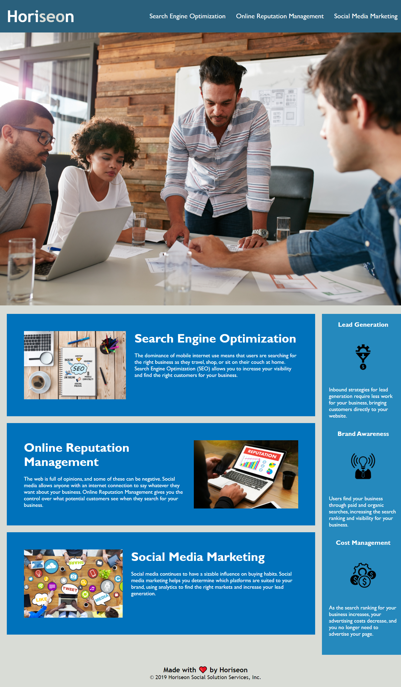

# Code Refactor Starter Code

## Website is Called # Horiseon

### Changes I made

1.  Added a semantic elements 
     * Header
     * nav
     * section
     * footer
2.  Made sure that the elements are in logical structure
3.  Added alt attributes in all images
     * Search Engine Optimization image 
     
     
     * Online Reputation Management image 
     
     
     * Social Media Marketing image 
     
    
     * Lead Generation image
     
     
     * Brand Awareness image
     
    
     * Cost Management image 
     
4.  Heading attributes are in order
5.  Change the title to "Horiseon Webpage"
6.  Made Search Engine Optimization heading clickable by adding div id

## Screenshot of the Website

## URLs of this project

### Live URL:  https://arlontuazon.github.io/First-Assign/

### Github repository URL:  https://github.com/ArlonTuazon/First-Assign/

    
